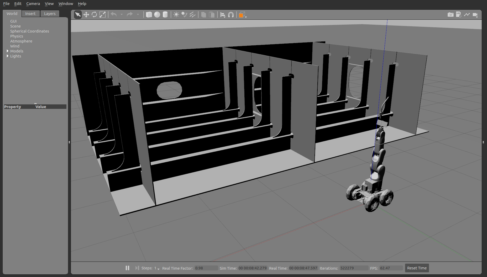
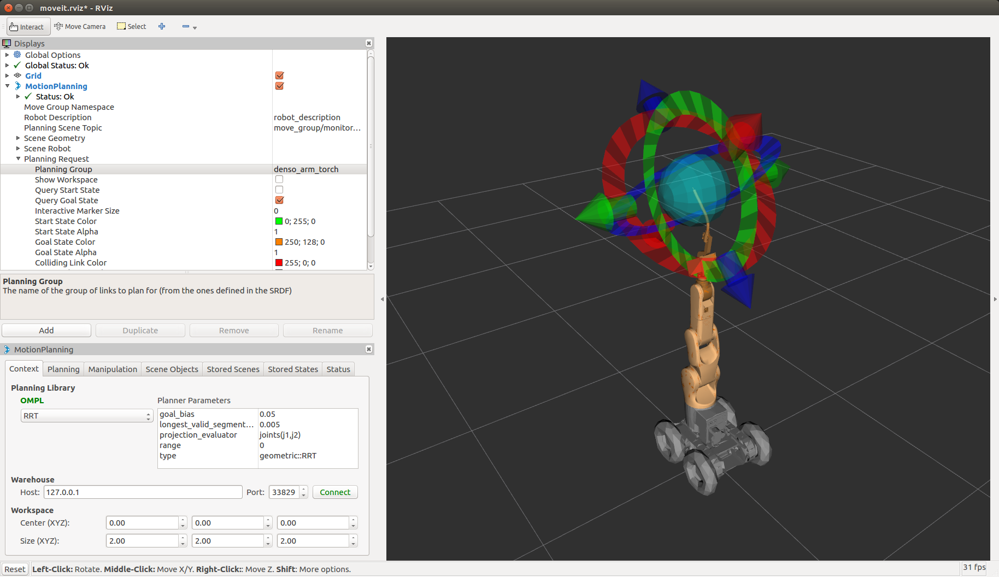

# Rover Denso

ROS package for a mobile manipulator combining a rover and a Denso VS050 manipulator for welding.

## Setup

Clone this repo into the *src* folder of a catkin workspace:

```bash
git clone https://chunfan@bitbucket.org/chunfan/rover_denso.git
```

Check for dependency packages:

```bash
rosdep check --from-paths . -i
```

You will need two external ROS packages
(realsense_gazebo_plugin & denso_robot_ros):

```bash
git clone https://github.com/SyrianSpock/realsense_gazebo_plugin.git
git clone https://github.com/DENSORobot/denso_robot_ros.git
```

and other packages available under ROS Melodic:

```bash
rosdep install --from-paths . --ignore-src -r -y
```

Finally, catkin-make the ROS packages.

```bash
cd .. && catkin_make
```

## How to run

Source the ROS package so that the system know where the location of the ROS package.

```bash
source devel/setup.bash
```

Source the gazebo model path.

```bash
source src/rover_denso/set_gazebo_path.sh
```

Launch the simulator.

```bash
roslaunch rover_denso_gazebo rover_denso_world.launch
```

You should see both RViz and Gazebo window:





### Rover Control

By default, the control of the robot simulator is through a joystick.

To control the rover using the keyboard, run the launch file with an additional parameter:

```bash
roslaunch rover_denso_gazebo rover_denso_world.launch keyboard_control:=true
```

You also must leave the terminal window active (leave it on top of all other windows). The keys allowed:

Moving around:

  u    i    o

  j    k    l

  m    ,    .

q/z : increase/decrease max speeds by 10%

w/x : increase/decrease only linear speed by 10%

e/c : increase/decrease only angular speed by 10%

anything else : stop

### Denso Arm Motion Planning using MoveIt

On RViz, you should see an interactive marker at the J6 of the Denso Arm. You can switch the marker to the welding tip as shown above by changing the planning group.

You can drag the marker around to your desired position and use the RViz MoveIt interface to do the motion planning. See MoveIt tutorial on how to do it.
